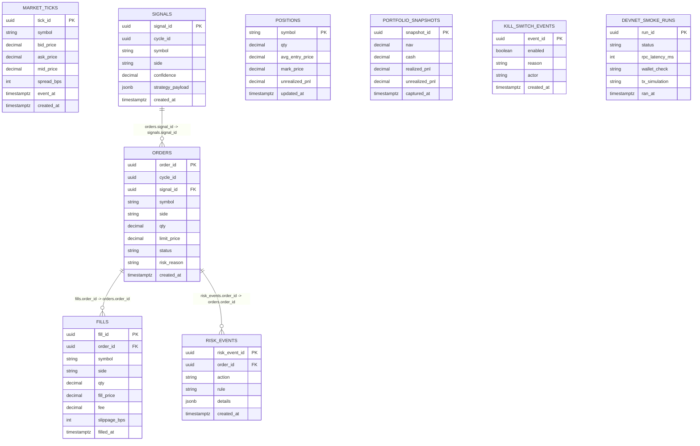

# Database Schema (Member 2)

Source context:
- `/Users/abhimaddi/Downloads/x402-layer-1/PROJECT_SPEC.md`
- `/Users/abhimaddi/Downloads/x402-layer-1/API_CONTRACT.md`

This file defines the initial PostgreSQL schema for the Trading API service in paper mode.

## 1. Key Terms (Plain English)

- `PK (Primary Key)`: unique ID for each row in a table.
- `FK (Foreign Key)`: a column that points to a row in another table.
- `One-to-many`: one parent row maps to many child rows.
- `Index`: speeds up lookups/filtering/sorting.
- `Composite key`: key made from multiple columns.

## 2. Key Design We Are Using

1. Every event/history table has its own UUID primary key.
2. Hard foreign keys (enforced):
- `orders.signal_id -> signals.signal_id`
- `fills.order_id -> orders.order_id`
- `risk_events.order_id -> orders.order_id`
3. `cycle_id` is a grouping ID (indexed), not a foreign key.
4. `positions` is current-state data, keyed by `symbol` for now.

## 3. Relationship Diagram

## 4. Table-by-Table Schema

### 4.1 `market_ticks`
Purpose: raw market snapshots used by strategy and mark pricing.

Columns:
- `tick_id UUID PK`
- `symbol TEXT NOT NULL`
- `bid_price NUMERIC(18,8) NOT NULL`
- `ask_price NUMERIC(18,8) NOT NULL`
- `mid_price NUMERIC(18,8) NOT NULL`
- `spread_bps INTEGER NOT NULL`
- `event_at TIMESTAMPTZ NOT NULL`
- `created_at TIMESTAMPTZ NOT NULL DEFAULT now()`

### 4.2 `signals`
Purpose: strategy outputs before risk/execution.

Columns:
- `signal_id UUID PK`
- `cycle_id UUID NOT NULL`
- `symbol TEXT NOT NULL`
- `side TEXT NOT NULL` (`buy|sell`)
- `confidence NUMERIC(6,5) NOT NULL`
- `strategy_payload JSONB NOT NULL DEFAULT '{}'::jsonb`
- `created_at TIMESTAMPTZ NOT NULL DEFAULT now()`

### 4.3 `orders`
Purpose: order intents and decision state.

Columns:
- `order_id UUID PK`
- `cycle_id UUID NOT NULL`
- `signal_id UUID NOT NULL FK -> signals(signal_id)`
- `symbol TEXT NOT NULL`
- `side TEXT NOT NULL` (`buy|sell`)
- `qty NUMERIC(18,8) NOT NULL`
- `limit_price NUMERIC(18,8)`
- `status TEXT NOT NULL` (`proposed|approved|rejected|executed|canceled`)
- `risk_reason TEXT`
- `created_at TIMESTAMPTZ NOT NULL DEFAULT now()`

### 4.4 `fills`
Purpose: simulated executions (one order can have multiple fills).

Columns:
- `fill_id UUID PK`
- `order_id UUID NOT NULL FK -> orders(order_id)`
- `symbol TEXT NOT NULL`
- `side TEXT NOT NULL` (`buy|sell`)
- `qty NUMERIC(18,8) NOT NULL`
- `fill_price NUMERIC(18,8) NOT NULL`
- `fee NUMERIC(18,8) NOT NULL DEFAULT 0`
- `slippage_bps INTEGER NOT NULL DEFAULT 0`
- `filled_at TIMESTAMPTZ NOT NULL`

### 4.5 `positions`
Purpose: latest current holdings per symbol.

Columns:
- `symbol TEXT PK`
- `qty NUMERIC(18,8) NOT NULL`
- `avg_entry_price NUMERIC(18,8) NOT NULL`
- `mark_price NUMERIC(18,8) NOT NULL`
- `unrealized_pnl NUMERIC(18,8) NOT NULL`
- `updated_at TIMESTAMPTZ NOT NULL DEFAULT now()`

Note:
- For single-user hackathon scope, `symbol` PK is enough.
- For multi-user later, change PK to `(account_id, symbol)`.

### 4.6 `portfolio_snapshots`
Purpose: time-series NAV and PnL.

Columns:
- `snapshot_id UUID PK`
- `nav NUMERIC(18,8) NOT NULL`
- `cash NUMERIC(18,8) NOT NULL`
- `realized_pnl NUMERIC(18,8) NOT NULL`
- `unrealized_pnl NUMERIC(18,8) NOT NULL`
- `captured_at TIMESTAMPTZ NOT NULL`

### 4.7 `risk_events`
Purpose: audit trail for risk policy actions.

Columns:
- `risk_event_id UUID PK`
- `order_id UUID NOT NULL FK -> orders(order_id)`
- `action TEXT NOT NULL` (`blocked|allowed|warned`)
- `rule TEXT NOT NULL`
- `details JSONB NOT NULL DEFAULT '{}'::jsonb`
- `created_at TIMESTAMPTZ NOT NULL DEFAULT now()`

### 4.8 `kill_switch_events`
Purpose: on/off toggle audit trail.

Columns:
- `event_id UUID PK`
- `enabled BOOLEAN NOT NULL`
- `reason TEXT`
- `actor TEXT`
- `created_at TIMESTAMPTZ NOT NULL DEFAULT now()`

### 4.9 `devnet_smoke_runs`
Purpose: operational checks, separate from trading PnL.

Columns:
- `run_id UUID PK`
- `status TEXT NOT NULL` (`passed|failed`)
- `rpc_latency_ms INTEGER`
- `wallet_check TEXT`
- `tx_simulation TEXT`
- `ran_at TIMESTAMPTZ NOT NULL`

## 5. Required Indexes

Create indexes for API filters and timeline queries:

- `market_ticks(symbol, event_at DESC)`
- `signals(cycle_id)`
- `signals(symbol, created_at DESC)`
- `orders(cycle_id)`
- `orders(symbol, created_at DESC)`
- `orders(status, created_at DESC)`
- `fills(order_id, filled_at DESC)`
- `fills(symbol, filled_at DESC)`
- `portfolio_snapshots(captured_at DESC)`
- `risk_events(order_id, created_at DESC)`
- `risk_events(created_at DESC)`
- `devnet_smoke_runs(ran_at DESC)`

## 6. Minimal Integrity Rules

- `ask_price >= bid_price` for `market_ticks`
- `qty > 0` for `orders` and `fills`
- `slippage_bps >= 0`
- `confidence >= 0 AND confidence <= 1`

## 7. Why This Works for Hackathon Scope

- Clear lineage: `signal -> order -> fill`
- Fast timeline reads for UI (`orders`, `fills`, `snapshots`)
- Risk and kill-switch are fully auditable
- Simple enough to build quickly, extensible later
