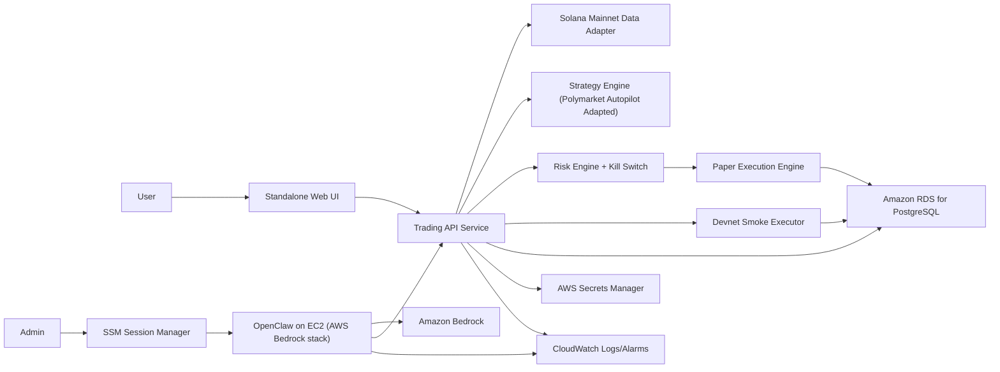

# Solana Autopilot on OpenClaw (AWS Bedrock) - Project Specification

## 1. Product Idea
Build a user-facing app where each user can deploy their own OpenClaw instance on AWS, connect strategy settings, and run an autonomous Solana trading bot in paper mode.

The bot uses real-time Solana market data, executes simulated trades, and reports performance in a standalone UI.

## 2. Goals
1. Deploy OpenClaw on AWS using Bedrock as the model provider.
2. Adapt the `polymarket-autopilot` use case to Solana.
3. Run autonomous paper trading with strict server-side risk controls.
4. Provide a standalone web UI for deploy, control, and monitoring.

## 3. Non-Goals
1. No guaranteed profits.
2. No live mainnet trading in this phase.
3. No custom OpenClaw skill creation in this phase.
4. No Discord integration in this phase.

## 4. Key Decisions
1. OpenClaw deployment baseline: `sample-OpenClaw-on-AWS-with-Bedrock`.
2. Data mode: real-time Solana market data for paper simulation.
3. Storage: Amazon RDS for PostgreSQL.
4. UI: standalone web app (not Discord).
5. Skills: prepackaged at deployment time from zip artifacts.
6. Safety: risk engine and kill switch are backend enforcement, not prompt-only behavior.

## 5. System Architecture

## 6. Component Specifications

| Component | Responsibility | Notes |
|---|---|---|
| OpenClaw Runtime | Orchestration and natural-language control | Runs on EC2 from AWS sample stack |
| Bedrock Model Layer | Reasoning and planning | Configure target model in stack params |
| Trading API Service | Core backend control plane | Single service for speed in hackathon scope |
| Market Data Adapter | Pull real-time Solana market data | Mainnet feeds only for realism |
| Strategy Engine | Generate trade intents | Adapted from polymarket-autopilot logic |
| Risk Engine | Enforce trade limits | Hard gate before any execution |
| Kill Switch | Immediate global stop | Backend flag checked before execution |
| Paper Execution Engine | Simulated fills and PnL | Includes fees/slippage assumptions |
| Devnet Smoke Executor | Wallet/RPC transaction health tests | Operational checks only, not PnL |
| RDS PostgreSQL | Persist all state | Orders, fills, positions, PnL, risk events |
| Standalone UI | Deploy/configure/monitor per user | Login, bot state, trade history, controls |

## 7. Core Data Model (Minimum)

| Table | Purpose |
|---|---|
| `market_ticks` | Price snapshots and spread metrics |
| `signals` | Strategy outputs and confidence |
| `orders` | Intended and approved/rejected orders |
| `fills` | Simulated fill records |
| `positions` | Current exposure by pair |
| `portfolio_snapshots` | NAV and PnL timeline |
| `risk_events` | Rule violations and blocks |
| `kill_switch_events` | Stop/start audit trail |
| `devnet_smoke_runs` | Smoke test results and latency |

## 8. Execution Modes
1. `paper_mode` (default): real-time market data with simulated execution.
2. `devnet_smoke_mode` (optional): verifies wallet signing and RPC reliability.
3. `live_mode`: not implemented in this phase.

## 9. End-to-End Flow
1. User logs into standalone UI.
2. User deploys OpenClaw instance on AWS.
3. System bootstraps prepackaged skills and trading backend.
4. User configures strategy and risk settings.
5. OpenClaw schedules or triggers trade cycle.
6. Strategy proposes orders.
7. Risk engine approves/rejects.
8. Approved orders are paper-executed and persisted.
9. UI displays positions, PnL, logs, and system health.

## 10. 4-Person Team Plan (Sequential Phases)

| Phase | Time | Person 1 (Infra/OpenClaw) | Person 2 (Backend/Data) | Person 3 (Strategy/Risk) | Person 4 (UI/Product) | Exit Criteria |
|---|---|---|---|---|---|---|
| 0. Spec Freeze | H0-H2 | Region/model/deploy decisions | API contract draft | Risk policy draft | UX flow draft | Scope signed |
| 1. AWS Deploy | H2-H8 | Deploy stack + SSM + OpenClaw health | RDS + secrets integration | Logs/alarms baseline | Operator access test | OpenClaw + Bedrock + RDS ready |
| 2. Skills Bootstrap | H8-H12 | Zip artifact packaging | Boot install script | Solana adaptation from polymarket autopilot | Validation tests | Instance boots with assets loaded |
| 3. Engines Build | H12-H24 | OpenClaw orchestration hooks | Market data + paper execution | Strategy + risk + kill switch | Status views + basic UX wiring | Paper loop works end-to-end |
| 4. UI + Deploy UX | H24-H32 | Deploy/status APIs | Backend integration endpoints | Risk control APIs | Full UI: deploy/configure/monitor | User can deploy and operate bot |
| 5. Test + Harden | H32-H36 | Recovery/restart tests | Integration/data tests | Safety tests and fail-safe drills | UAT + demo script | Demo-ready system |

## 11. Role Responsibilities

| Person | Primary Ownership | Secondary Ownership |
|---|---|---|
| Person 1 | AWS infra, OpenClaw runtime, bootstrap | CI/CD and operational runbooks |
| Person 2 | Trading API, market data, paper execution, RDS | API integration with UI/OpenClaw |
| Person 3 | Strategy adaptation, risk engine, kill switch | Safety validation and guardrails |
| Person 4 | Standalone UI, user workflows, test/demo flow | Product acceptance and docs |

## 12. Acceptance Criteria
1. A new user can deploy an instance from UI and see status transitions to healthy.
2. OpenClaw can trigger autonomous paper trade cycles without manual shell access.
3. Every order is blocked unless risk engine approves it.
4. Kill switch halts all new executions immediately.
5. Portfolio and PnL are visible in UI and backed by RDS data.
6. Devnet smoke test can run and record results without affecting paper PnL.

## 13. Risks and Mitigations

| Risk | Mitigation |
|---|---|
| Market data outages/staleness | Staleness checks and provider fallback |
| Overtrading from noisy signals | Confidence thresholds and cooldowns |
| Unsafe autonomous actions | Server-side risk gate plus kill switch |
| Deployment drift | Immutable bootstrap scripts and versioned artifacts |
| Time overrun | Strict phase gates and deferred non-core features |

## 14. Deliverables
1. Deployed AWS-backed OpenClaw environment template.
2. Solana-adapted autopilot engine (paper mode).
3. Standalone UI for deployment and monitoring.
4. RDS-backed persistence and observability.
5. Demo runbook and test results.

